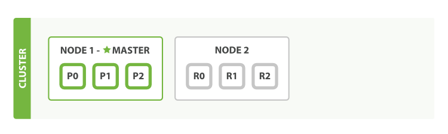

故障转移
===========

* [空集群](an-empty-cluster.md)
* [集群健康](cluster-health.md)
* [添加索引](add-an-index.md)
* [故障转移](add-failover.md)
* [水平扩展](scale-horizontally.md)
* [应对失败](coping-with-failure.md)


运行一个节点意味着你有单点故障的可能性，幸运的是，我们仅仅需要增加另外一个节点就可以防止数据丢失。

> 开始第2个提示
> -------------
> 为了了解添加第2个节点时发生了什么，你可以从同一个目录，完全照搬添加第一个节点时的方法（查看[安装Elasticsearch](installing-elasticsearch.md)）。不同的节点可以公用相同的目录。

> 由于第2个节点和第1个节点使用了相同的`cluster.name`（查看`./config/elasticsearch.yml`文件），它可以被自动发现并加入到第1个节点的集群中去。如果没有这样，检查日志找出原因。一般是因为你的网络禁用了多路广播，或者节点间的通讯被防火墙所屏蔽。

如果我们启动了第2个节点，我们的集群看起来会像图3所示，“双节点集群——所有主、复制分片已分配好”



图3.双节点集群——所有主、复制分片已分配好


第2个节点已经加入集群，3个复制分片已经在它上面被分配好，每个对应一个主分片。这就意味着，任何一个节点出了问题，我们的数据都是完整的。

新的索引文档将首先被存储在主分片，然后被平行地拷贝到关联的复制分片上。这保证文档能通过主分片或者对应的复制分片都能被访问到。

现在，集群状态显示为`green`，表明所有6个分片（3个主分片和3个复制分片）都是正常的：

```json
{
    "cluster_name":          "elasticsearch",
    "status":                "green", 
    "timed_out":             false,
    "number_of_nodes":       2,
    "number_of_data_nodes":  2,
    "active_primary_shards": 3,
    "active_shards":         6,
    "relocating_shards":     0,
    "initializing_shards":   0,
    "unassigned_shards":     0
}
```

我们的集群现在不仅仅功能齐全，而且一直可用。


------------------------------------

[« 添加索引](add-an-index.md)   [水平扩展 »](scale_horizontally.md)
