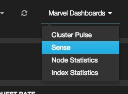

运行Elasticsearch
================================

* [安装Elasticsearch](installing-elasticsearch.md)
* [运行Elasticsearch](running-elasticsearch.md)
* [和Elasticsearch交流](talking-to-elasticsearch.md)
* [面向文档](document-oriented.md)
* [找找感觉](finding-your-feet.md)
* [索引文档](indexing-employee-documents.md)
* [检索文档](retrieving-a-document.md)
* [简单搜索](search-lite.md)
* [使用DSL搜索](search-with-query-dsl.md)
* [复杂点的搜索](more-complicated-searches.md)
* [全文搜索](full-text-search.md)
* [短语搜索](phrase-search.md)
* [高亮搜索结果](highlighting-our-searches.md)
* [分析](analytics.md)
* [教程总结](tutorial-conclusion.md)
* [分布式特性](distributed-nature.md)
* [接下来](next-steps.md)

Elasticsearch现在准备好了，你可以按下面的命令在前台启动它：

```shell
./bin/elasticsearch
```

如果想让它在后台运行，增加`-d`参数即可。

打开另外的终端，运行下述命令，即可对它进行测试：

```shell
curl 'http://localhost:9200/?pretty'
```

你可能会看到下面的响应：

```json
{
   "status": 200,
   "name": "Shrunken Bones",
   "version": {
      "number": "1.4.0",
      "lucene_version": "4.10"
   },
   "tagline": "You Know, for Search"
}
```

这意味着Elasticsearch已经正常运行了，我们可以开始体验它了。


> 提示
-------
一个节点运行一个Elasticsearch的实例，一个集群是一组具有相同的`cluster.name`的节点组成的，彼此共享数据，提供故障转移和扩展。虽然一个节点也能组成由它自己组成的一个集群。

你应该把默认`clluster.name`修改成你喜欢的名称，比如你自己的名字，这样可以防止你的节点加入到通网络具有同样名字的集群。

你可以在config目录下找到elasticsearch.yml文件修改集群的名称，然后重启Elasticsearch。当Elasticsearch是在前台运行时，Ctrl+C即可停止；另外，你也可以通过`shutdown`API来停止它：

```shell
curl -XPOST 'http://localhost:9200/_shutdown'
```
查看`marvel`和`sense`
-------------------


如果你安装的Marvel管理监控工具，你可以通过浏览器打开网址[http://localhost:9200/_plugin/marvel/](http://localhost:9200/_plugin/marvel/)直接使用。

点击“Marvel dashboards”下拉框的“Sense”可以进入Sense开发控制台，也可直接访问[http://localhost:9200/_plugin/marvel/sense/](http://localhost:9200/_plugin/marvel/sense/)。


----------------------

[« 安装Elasticsearch](installing-elasticsearch.md)      [和Elasticsearch交流 »](talking-to-elasticsearch.md)
